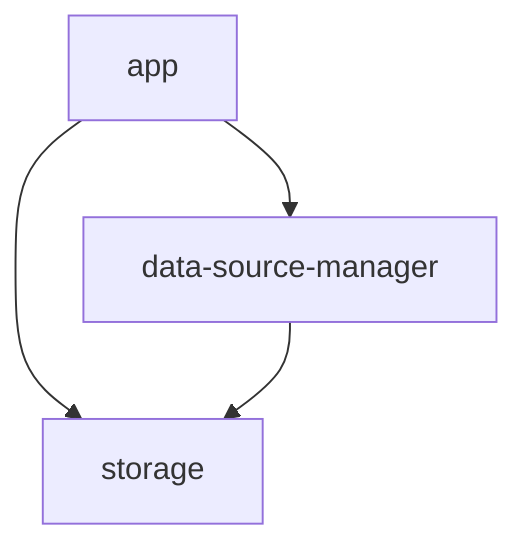
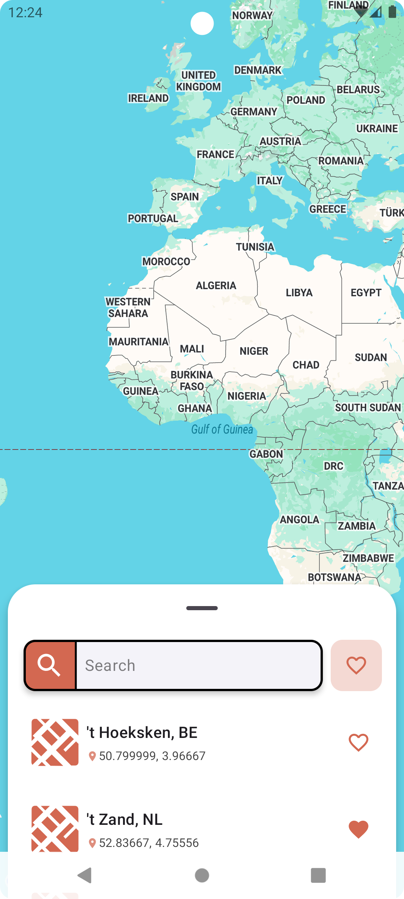
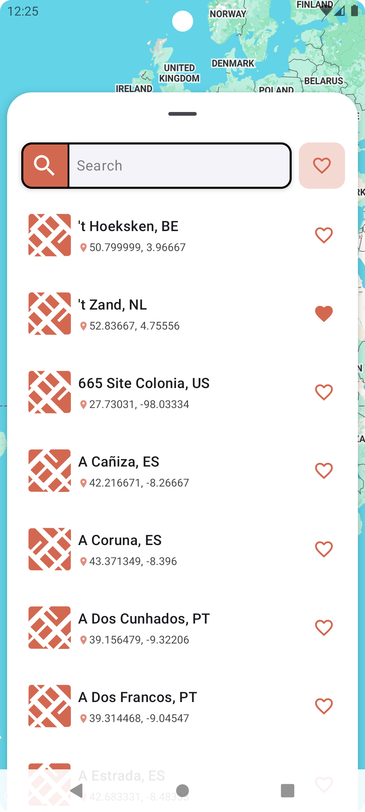
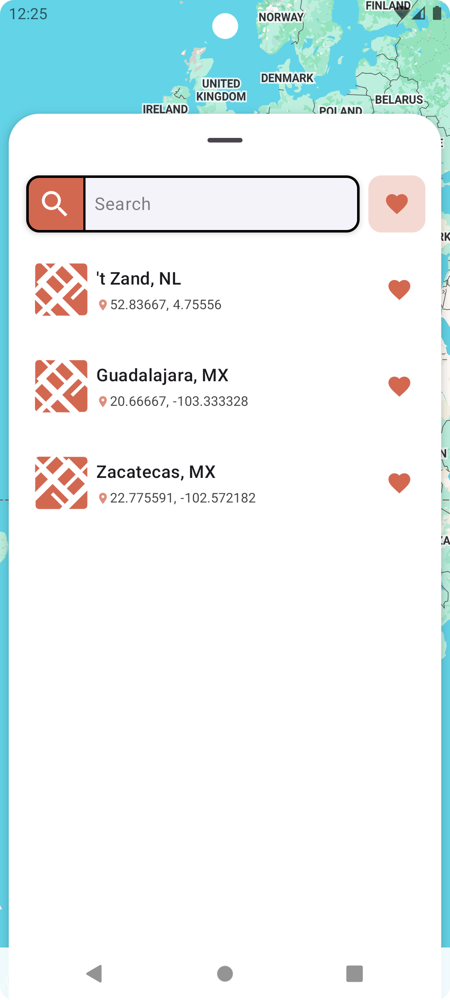
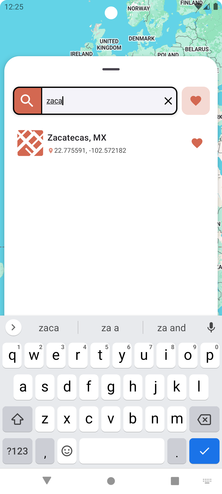
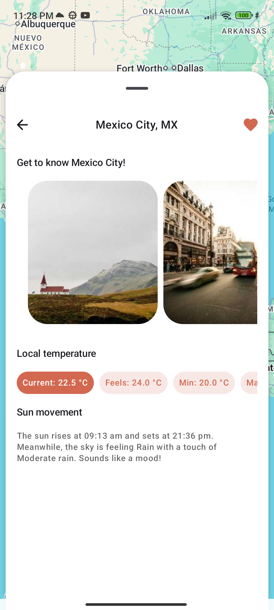
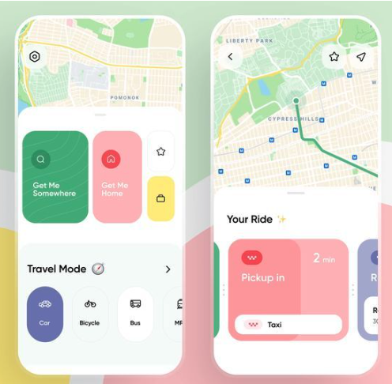

<div align="center">
  <div style="display: flex; justify-content: center;">
    <div style="border: 0px solid black; padding: 15px; margin: 5px;">
      
      <p>  </p>
      <p>Hi <strong>Developer</strong>!</p>
      <p>  </p>
      <p>In this project, you’ll find the Android project evaluation! 💪</p>
    </div>
  </div>
</div>

***

## 🧩 Module Type

**Main Application Module** – This is the entry point of the application and the UI layer
responsible for displaying city-related features using Jetpack Compose.

## 🎯 Purpose

The `app` module is the central module of the project. It brings together UI, navigation, storage,
and data-source layers to provide a complete user experience for:

- Viewing a **list of cities**.
- Displaying each city’s **details and weather information**.
- Visualizing cities on a **Google Map**.
- Presenting rich UIs like **image carousels**, **bottom sheets**, and responsive layouts.

## 🏗 Architecture Overview

This module integrates:

- The [`storage`](storage/README.md) module for local data persistence.
- The [`data-source-manager`](data-source-manager/README.md) module for API access and domain data
  orchestration.
- UI and navigation using **Jetpack Compose** and **Navigation Component**.



---

## 🔧 Features

- 🔎 City Search and Paginated List
- ❤️ Favorite Cities Management
- 📍 Google Map integration with camera control
- 🌦️ Weather data from OpenWeatherMap
- 🖼️ Image carousel from Picsum
- 🧭 Navigation with animated transitions
- 📦 Offline-first architecture (for the Cities list)

# 📱 Screenshots

| Splash                                                       | City list                                                              | BottomSheet opened                                                |
|--------------------------------------------------------------|------------------------------------------------------------------------|-------------------------------------------------------------------|
|  |  |  |


| Filter favorites                                                       | Filter prefix                                                     | City details                                                     |
|------------------------------------------------------------------------|-------------------------------------------------------------------|------------------------------------------------------------------|
|  |  |  |

## Approach to handle the Gist

This was very hard cause the Gist has a 200K values, so I had to implement a Repository to download
and store the information to be able to use this more efficiently in the app for future app "
openings".
The Repository is responsible for fetching the data from the Gist and storing it in a local database
using Room.

## Approach to solve Search

1. The search functionality is implemented using a **TextField** that captures user input.
2. The app listens for changes in the text field and updates the "prefix" value in the ViewModel.
    1. The prefix has a debounce of 250 milliseconds to avoid excessive calls when the user is
       typing, this help use to make the call and UI refresh more efficient.
    2. The prefix is used to filter the list of cities based on the user input.
3. The filter is not only for the prefix but also for the "favorite" status of the cities.
    1. The app displays a list of cities that match the prefix and favorites.
        1. If the "favorite" toggle is enabled, only cities that are marked as favorites are shown.
        2. If the "favorite" toggle is disabled, all cities that match the prefix are shown.
    2. If no cities match the prefix, an empty View is shown.
    3. The user can toggle the favorite status of each city by clicking on the heart icon.
4. The search is no case-insensitive and matches city names based on the input.

## 📐 Design Inspirations & Tools

### 🧠 Inspiration

<details>
<summary>Pinterest Concept</summary>
<br>

</details>

### 🧭 Navigation

- [Navigation UI Design](https://developer.android.com/guide/navigation/design)

### 💾 Storage

- [Data Storage](https://developer.android.com/training/data-storage)
- [Room](https://developer.android.com/training/data-storage/room)

### 💉 Dependency Injection

- [Koin DI in Android](https://insert-koin.io/docs/quickstart/android-compose/)

### 🎨 Icons & Graphics

These resources provide icons and graphics for use in the app:

- [SVG Repo](https://www.svgrepo.com/)
- [Icon Kitchen](https://icon.kitchen)

### 📐 Mocks & UI Flow

Initial UI designs and flow diagrams by using [Draw.io](https://draw.io)

### 📱 Components & Libraries

- **BottomSheet Scaffold (Compose)**  
  [BottomSheetScaffold - Material3](https://developer.android.com/reference/kotlin/androidx/compose/material3/package-summary#BottomSheetScaffold)

- **Google Maps Compose**  
  [MapProperties API](https://googlemaps.github.io/android-maps-compose/maps-compose/com.google.maps.android.compose/-map-properties/index.html)

- **Weather API**  
  [OpenWeatherMap – Current Weather](https://openweathermap.org/current)

- **Random Images**
    - [Picsum](https://picsum.photos/)
    - [Carousel Component](https://developer.android.com/develop/ui/compose/components/carousel)
    - [Coil for Image Loading](https://coil-kt.github.io/coil/compose/)

# ✅ Run the App

## Java version

This project uses Java 17 Zulu. Ensure you have the correct version installed on your local machine
to match the GitHub Actions workflow.

## Setting up Java 17 Zulu in Android Studio

### Build tools

1. **Open Android Studio**.
    - Go to `Settings` > `Build, Excecution, Deployment` > `Build Tools` > `Gradle`.
    - In the `Gradle Projects`, select the `Gradle JDK` to display the options.
    - If you have Zulu OpenJDK 17 installed, it should appear in the list. Select it.
    - If Zulu OpenJDK 17 is not listed, you may need to install it manually selecting the option
      `Download JDK`.
    - Select the version to `17` and then select the Zulu version, click to `Download`.
    - Once installed, select Zulu OpenJDK 17 from the list.
2. **Finally**, click `Apply` to save the changes
3. **Restart** Android Studio.
4. **Verify Installation**:
    - Open a terminal within Android Studio and run:
      ```sh
      java -version
      ```
    - Ensure the output shows Zulu OpenJDK 17.

To run the app, follow these steps:

1. Open the project in Android Studio.
2. Ensure you have the necessary API keys configured in `local.properties`:
    - `googleMapsApiKey` for Google Maps
    - `weatherMapApiKey` for OpenWeatherMap
3. Sync the project with Gradle files.
4. Select the `app` module as the run configuration.
5. Click the Run button.
6. The app should launch on your emulator or connected device.
